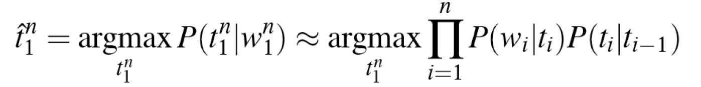

# Probabilistic POS Tagger

## What the Code Does?
Builds a bigram model based on the training data and performs Naïve Bayesian Classification (Bigram) based POS Tagging

## How to run?
### Training - Builds the Bigram model
If you run the code for the first time (i.e., if the bigram models are not stored in the same folder as the program) with 1 argument (Program file name) model will train on the training data and build the bigram model.

Example: python probabilistic.py

### Testing - Computes probability of test sentence
The program can be executed multiple times for testing once it is trained, But at each run, the program will only take one input sentence. The program takes 2 arguments (Program file name, test sentence)

  * Outputs: Maximum probability of the test sentence and the sequence of tags that resulted in the max probability. (Each word in the input sequence will be paired to the corresponding word in the output tag sequence)
  * Example: python probabilistic.py "closed in October and the jobs moved ." 

(NOTE: Test sentence must be included in double-quotes.
